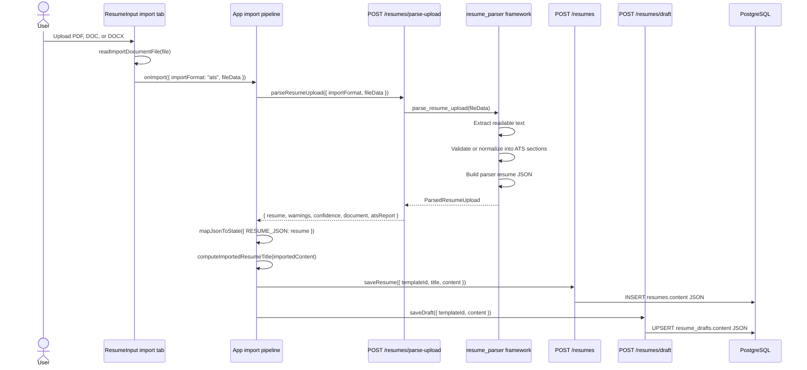
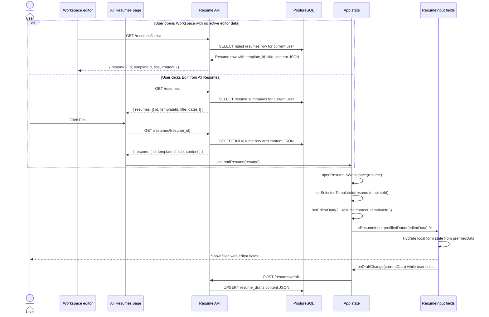

# ATS Resume Import Data Flow

This document shows how an uploaded ATS resume moves through MyResume, how parser fields map into editor fields, and where the final structured data is stored.

## End-To-End Flow



## Code Entry Points

| Stage | File | Function or endpoint | Responsibility |
| --- | --- | --- | --- |
| File selection | `ui/components/ResumeInput.tsx` | upload tab submit flow | Requires a PDF, DOC, or DOCX before import. |
| Browser file read | `ui/utils/resumeImport.ts` | `readImportDocumentFile` | Converts the selected document to `{ mimeType, data, name }`, where `data` is base64. |
| Import orchestration | `ui/App.tsx` | `importResumeFileToWorkspace` | Calls parse API, maps parser JSON into editor JSON, saves resume, saves draft, opens editor. |
| Flexible JSON mapping | `ui/App.tsx` | `mapJsonToState` | Converts parser field names and aliases into `UserInputData`. |
| Parse API client | `ui/services/resumeService.ts` | `parseResumeUpload` | Sends upload payload to `POST /resumes/parse-upload`. |
| Save API client | `ui/services/resumeService.ts` | `saveResume` | Sends final editor JSON to `POST /resumes`. |
| Draft API client | `ui/services/resumeService.ts` | `saveDraft` | Saves the imported content as the latest editable draft. |
| Parse API route | `services/app/api/routes/resumes.py` | `parse_upload` | Authenticates the user, parses upload, returns parser JSON, logs `RESUME_PARSE`. |
| Save API route | `services/app/api/routes/resumes.py` | `create_resume` | Inserts a `Resume` row and logs `RESUME_SAVE`. |
| Draft API route | `services/app/api/routes/resumes.py` | `save_draft` | Inserts or updates one draft per user/template and logs `RESUME_DRAFT_SAVE`. |
| Text extraction | `services/app/services/resume_parser/framework.py` | `_extract_upload_text` | Extracts text from PDF, DOCX, or legacy DOC bytes. |
| ATS normalization | `services/app/services/resume_parser/framework.py` | `parse_resume_text`, `_ats_text_from_resume_json` | Validates ATS shape or normalizes readable resume text into ATS-style sections. |
| Structured parser JSON | `services/app/services/resume_parser/framework.py` | `_local_resume_json_from_text` | Produces canonical parser JSON: header, summary, skills, experience, education, additional sections. |
| Database model | `services/app/models/entities.py` | `Resume`, `ResumeDraft` | Stores final editor content in JSON columns. |

## Upload Payload

The UI does not send raw `File` objects to the backend. It sends this JSON shape:

```json
{
  "importFormat": "ats",
  "fileData": {
    "mimeType": "application/pdf",
    "name": "candidate-resume.pdf",
    "data": "base64-encoded-document-bytes"
  }
}
```

Supported formats are PDF, DOC, and DOCX. The final saved resume does not keep this base64 `fileData`; it stores the mapped editor content instead.

## Backend Parser Output

`POST /resumes/parse-upload` returns parser JSON in this shape:

```json
{
  "resume": {
    "header": {
      "name": "Jordan Candidate",
      "title": "Software Architect",
      "location": "Seattle, WA",
      "phone": "555-555-0100",
      "email": "jordan@example.com",
      "links": [{ "label": "LinkedIn", "url": "linkedin.com/in/jordan" }]
    },
    "summary": "Architect focused on AI-enabled delivery.",
    "skills": {
      "Core": ["Cloud Architecture", "AI Engineering", "Python"]
    },
    "experience": [
      {
        "role": "Software Architect",
        "company": "Slalom",
        "location": "Seattle, WA",
        "start": "Jan 2022",
        "end": "Present",
        "highlights": [
          {
            "bullet": "Led AI accelerated engineering assessments.",
            "tags": [],
            "metrics": []
          }
        ]
      }
    ],
    "education": [
      {
        "school": "State University",
        "degree": "BS Computer Science",
        "location": "Richardson, TX",
        "start": "2012",
        "end": "2016",
        "notes": []
      }
    ],
    "additionalSections": [
      {
        "title": "Patents",
        "items": ["US123456 Method for queue prioritization"]
      }
    ]
  },
  "warnings": [],
  "confidence": {},
  "document": {
    "textExtracted": true,
    "kind": "pdf",
    "normalizedToAts": false
  },
  "atsReport": {
    "validated": true,
    "normalizedToAts": false,
    "sectionsDetected": ["summary", "skills", "experience", "education"]
  }
}
```

If the uploaded document is readable but not already ATS-shaped, the parser can normalize it into ATS-style sections. In that case `document.normalizedToAts` and `atsReport.normalizedToAts` are `true`.

## Parser JSON To Editor JSON Mapping

The frontend maps parser JSON into `UserInputData`, which is the shape stored in the database.

| Parser field | Editor field | Mapping behavior |
| --- | --- | --- |
| `header.name` | `personalDetails.firstName`, `personalDetails.lastName` | Splits full name on spaces unless explicit first/last fields exist. |
| `header.title` | `targetRole` | Preferred target role; falls back to first experience role. |
| `header.email` | `personalDetails.email` | Stored directly. |
| `header.phone` | `personalDetails.phone` | Stored directly. |
| `header.location` | `personalDetails.city`, `state`, `country`, `postalCode` | Parsed into address parts when possible. |
| `header.links[]` | `personalDetails.links` | Flattened into comma-separated display text such as `LinkedIn: linkedin.com/in/name`. |
| `summary` | `personalDetails.summary` | Stored directly. |
| `experience[]` | `experienceItems[]` | Each role maps to `{ id, role, company, dates, description }`. |
| `experience[].start/end` | `experienceItems[].dates` | Joined as `start - end`. |
| `experience[].highlights[].bullet` | `experienceItems[].description` | Joined as newline bullet text. |
| `education[]` | `educationItems[]` | Each entry maps to `{ id, degree, school, location, dates }`. |
| `education[].start/end` | `educationItems[].dates` | Joined as `start - end`. |
| `skills` object | `skillItems[]` | Each category becomes `{ id, category, items }`; values become comma-separated text. |
| `additionalSections[]` | `additionalSections[]` | Each section maps to `{ id, title, items }`; item arrays become newline-separated text. |
| Unknown top-level parser keys | `additionalSections[]` | Any parser key not consumed by core fields becomes an additional section. |

## Final Database Shape

The saved resume row is created by `POST /resumes`.

```json
{
  "templateId": "classic_pro",
  "title": "Jordan Candidate - Software Architect",
  "content": {
    "role": "user",
    "plan": "PLAN_FREE",
    "templateId": "classic_pro",
    "targetRole": "Software Architect",
    "preferences": {
      "pages": "1-page",
      "tone": "modern",
      "region": "US",
      "photo": false
    },
    "personalDetails": {
      "firstName": "Jordan",
      "lastName": "Candidate",
      "email": "jordan@example.com",
      "phone": "555-555-0100",
      "links": "LinkedIn: linkedin.com/in/jordan",
      "address": "",
      "city": "Seattle",
      "state": "WA",
      "country": "",
      "postalCode": "",
      "summary": "Architect focused on AI-enabled delivery."
    },
    "experienceItems": [
      {
        "id": "generated-client-id",
        "role": "Software Architect",
        "company": "Slalom",
        "dates": "Jan 2022 - Present",
        "description": "- Led AI accelerated engineering assessments."
      }
    ],
    "educationItems": [
      {
        "id": "generated-client-id",
        "degree": "BS Computer Science",
        "school": "State University",
        "location": "Richardson, TX",
        "dates": "2012 - 2016"
      }
    ],
    "certificationItems": [],
    "skillItems": [
      {
        "id": "generated-client-id",
        "category": "Core",
        "items": "Cloud Architecture, AI Engineering, Python"
      }
    ],
    "additionalSections": [
      {
        "id": "generated-client-id",
        "title": "Patents",
        "items": "US123456 Method for queue prioritization"
      }
    ]
  }
}
```

That payload becomes:

| Table | Column | Value |
| --- | --- | --- |
| `resumes` | `id` | Backend generated `res_*` id. |
| `resumes` | `user_id` | Current authenticated user id. |
| `resumes` | `template_id` | Selected template, or import default `classic_pro`. |
| `resumes` | `title` | Computed from candidate name and target role. |
| `resumes` | `content` | Full `UserInputData` JSON shown above. |
| `resumes` | `created_at`, `updated_at` | Database timestamps. |
| `resume_drafts` | `user_id`, `template_id`, `content` | Same imported content, upserted as the latest editor draft. |
| `activity_logs` | `action`, `details` | Parse/save/draft audit entries such as `RESUME_PARSE`, `RESUME_SAVE`, and `RESUME_DRAFT_SAVE`. |

## Database To Web Editor Load Flow

The database does not split every resume field into separate columns. MyResume stores the editable resume as one JSON document in `resumes.content`. When the user opens the editor, that JSON document is loaded back into React state and then into the individual form fields.



## Loaded Database JSON To Form Fields

| Stored JSON path in `resumes.content` | Web editor state | Visible editor fields |
| --- | --- | --- |
| `templateId` plus row `template_id` | `selectedTemplateId`, `prefilledData.templateId` | Selected resume template and preview template. |
| `targetRole` | `targetRole` | Target role input. |
| `jobDescription` | `jobDescription` | Job description text area. |
| `jobUrl` | `jobUrl` | Job URL input. |
| `preferences` | `preferences` | Pages, tone, region, and photo options. |
| `profileImageUrl`, `profileImageName`, `profileImageData` | `profileImageUrl`, `profilePhotoName`, `legacyProfileImageData` | Profile photo controls and preview. |
| `personalDetails.firstName` | `personalDetails.firstName` | First Name input. |
| `personalDetails.lastName` | `personalDetails.lastName` | Last Name input. |
| `personalDetails.email` | `personalDetails.email` | Email input. |
| `personalDetails.phone` | `personalDetails.phone` | Phone input. |
| `personalDetails.links` | `personalDetails.links` | LinkedIn, GitHub, portfolio, or website input. |
| `personalDetails.address` | `personalDetails.address` | Street address input. |
| `personalDetails.country` | `personalDetails.country` | Country input. |
| `personalDetails.state` | `personalDetails.state` | State input. |
| `personalDetails.city` | `personalDetails.city` | City input. |
| `personalDetails.postalCode` | `personalDetails.postalCode` | ZIP or postal code input. |
| `personalDetails.summary` | `personalDetails.summary` | Professional summary text area. |
| `experienceItems[]` | `experiences` | Experience repeaters: role, company, dates, description. |
| `educationItems[]` | `educations` | Education repeaters: degree, school, location, dates. |
| `certificationItems[]` | `certifications` | Certification repeaters. |
| `skillItems[]` | `skills` | Skill category repeaters. |
| `additionalSections[]` | `additionalSections` | Additional section repeaters for projects, awards, publications, patents, languages, volunteer work, and other imported sections. |

## Editor Hydration Code Path

| Step | File | Function or code path | What happens |
| --- | --- | --- | --- |
| Fetch latest saved resume | `ui/services/resumeService.ts` | `getLatestResume` | Calls `GET /resumes/latest` and returns `{ resume }` with full `content`. |
| Fetch selected library resume | `ui/services/resumeService.ts` | `getResume` | Calls `GET /resumes/{id}` and returns the selected resume with full `content`. |
| Serialize backend row | `services/app/api/routes/common.py` | `to_resume_out` | Converts SQLAlchemy `Resume` row to `{ id, templateId, title, content, createdAt, updatedAt }`. |
| Open in workspace | `ui/App.tsx` | `openResumeInWorkspace` | Copies `resume.content` into `editorData`, preserves `resume.templateId`, stores loaded resume id/title, and opens the workspace. |
| Mount editor | `ui/App.tsx` | `<ResumeInput prefilledData={visibleEditorData} />` | Passes the stored JSON into the editor component. |
| Hydrate form controls | `ui/components/ResumeInput.tsx` | `prefilledData` initialization and effect | Splits the JSON into local form state for personal details, experience, education, certifications, skills, additional sections, preferences, and media. |
| Autosave edits | `ui/components/ResumeInput.tsx` | `onDraftChange(currentData)` | Rebuilds the full editor JSON and sends it to `POST /resumes/draft` after edits. |

The “All Resumes” page also uses `selectedResume.content` directly for read-only preview rendering through `LivePreview`, but the editable web fields are populated through `openResumeInWorkspace` and `ResumeInput.prefilledData`.

## Important Boundaries

- `POST /resumes/parse-upload` parses and returns structured data, but it does not create a saved resume row.
- `POST /resumes` is the database write that creates the saved resume.
- `POST /resumes/draft` saves the same imported editor JSON as the current draft for that template.
- The original base64 file upload is not stored in `resumes.content`.
- Parser metadata such as `warnings`, `confidence`, `document`, and `atsReport` is returned to the frontend for import UX and diagnostics. The saved resume content stores the mapped editor fields.
- Template rendering reads the saved `content` JSON through `LivePreview`, including `additionalSections` for fields that do not fit the core MyResume form.
